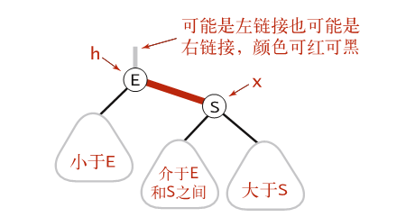
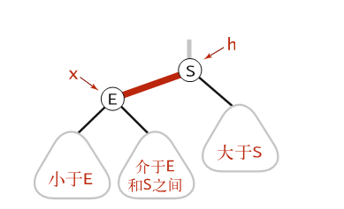

### 算法补充学习
有个红黑树的pdf——最早是在博客园看到的[红黑树详细分析，看了都说好](https://www.cnblogs.com/nullllun/p/8214599.html#autoid-3-2-0)
,里面的图片丢失了，在掘金截了图保存
#### 2-3查找树
##### 查找
要判断一个键是否在树中，我们先将它和根结点中的键比较。如果它和其中任意一个相等，查找命中；否则我们就根据比较的结果找到指向相应区间的链接，并在其指向的子树中递归地继续查找。如果这是个空链接，查找未命中。

##### 插入

要在 2-3 树中插入一个新结点，我们可以和二叉查找树一样先进行一次未命中的查找，然后把新结点挂在树的底部。但这样的话树无法保持完美平衡性。

1. 如果未命中的查找结束于一个 2- 结点，只要把这个 2-结点替换为一个 3- 结点，将要插入的键保存在其中即可
2. 向一棵只含有3-结点的树插入新键
   1. 向一棵只有3-节点的树中插入新键，为了将新键插入，我们先临时将新键存入该结点中，使之成为一个 4- 结点。它很自然地扩展了以前的结点并含有 3 个键和 4 条链接。很容易将它转换为一棵由3个2-结点组成的2-3树，其中一个结点（根）含有中键，一个结点含有 3 个键中的最小者（和根结点的左链接相连），一个结点含有 3 个键中的最大者（和根结点的右链接相连）。
   2. 向一个父结点为2-结点的3-结点中插入新键：在这种情况下我们需要在维持树的完美平衡的前提下为新键腾出空间。我们先像刚才一样构造一个临时的 4- 结点并将其分解，但此时我们不会为中键创建一个新结点，而是将其移动至原来的父结点中。
   3. 向一个父结点为3-结点的3-结点中插入新键：和刚才一样构造一个临时的 4- 结点并分解它，然后将它的中键插入它的父结点中。但父结点也是一个 3- 结点，因此我们再用这个中键构造一个新的临时 4- 结点，然后在这个结点上进行相同的变换，即分解这个父结点并将它的中键插入到它的父结点中去。
   4. 分解根结点：如果从插入结点到根结点的路径上全都是3-结点，我们的根结点最终变成一个临时的4-结点。此时我们可以按照向一棵只有一个 3- 结点的树中插入新键的方法处理这个问题。我们将临时的 4-
      结点分解为 3 个 2- 结点，使得树高加 1。

#### 红黑树

##### 定义-基于2-3树的实现的定义

1. 红链接均为左连接

2. 没有任何一个结点同时和两条红链相连接

3. 该树是完美黑色平衡的，即任意空连接到根节点的路径上的黑链接数量相同

4.  保证任意节点到其每个叶子节点路径最长不会超过最短路径的2倍。

   

实现：

1. 每个节点只会有一个指向自己的结点，用boolean变量保存连接的颜色，红色为true，黑色为false，并约定空连接为黑色，其根节点为黑色。

旋转操作：

##### 左旋转

右链接为红色，必需要旋转


```java
Node rotateLeft(Node h){
    Node x = h.right;
    h.right = x.left;
    x.left = h;
    x.color = h.color;
    h.color = RED;
    x.N = h.N;
    h.N = 1+size(h.left)+size(h.right);
    return x;
}
```

##### 右旋转

左链接为红色，且需要旋转，原因为可能为两条红链接连续



```java
Node rotateRight(Node h){
    Node x = h.left;
    h.left = x.right;
    x.right = h;
    x.color = h.color;
    h.color = RED;
    x.N=h.N;
    h.N = 1+size(h.left)+size(h.right);
    return x;
}
```

##### 单个2-结点中插入新键


一棵仅含有一个键的红黑树只含有一个2-结点，插入一个键之后需要立刻旋转，如果新键小于老键，只需要增加一个红色的结点就可以了，如果新键大于老键，那么新增的红色结点将会产生一条红色的右连接，需要立刻右旋转。

##### 向树底部的2-结点插入新键


用和二叉查找树相同的方式向一棵红黑树中插入一个新键会在树的底部新增一个结点，但总是用红链接将新节点和其父结点相连接，如果指向新节点的是父结点的左连接，那么父结点就直接成为一个3-结点，如果指向新结点的是父结点的右连接，那么就需要通过左旋转修正。

##### 向一棵双键树（即3-结点）中插入新键

- 新键大于原树中的两个键

此时树是平衡的，根节点为中间大小的键，其具有两条红链接，分别为较大节点和较小结点，只要将这两个连接的颜色都变为黑色就可以得到一棵由三个节点构成的，高为2的树。


- 新键小于原树中的键

这时它会被连接到最左边的空连接，这样就产生了两条连续的红连接，此时需要将上层的红链接右旋转可以得到第一种情况（中键为根节点且和其他两个结点的连接为红色连接）。


- 新键介于原树中的两个键中间，这又会产生两条连续的红连接，一条红色左连接连接一条红色右连接，此时需要将下层的红链接左旋转可得到第二种情况（两条连续的红色左连接）


##### 颜色转换

将子结点的由红变黑外，还要将父结点的颜色由黑变红。


##### 根节点的颜色总是黑色

每次执行完插入操作之后都会将根节点置为黑色

##### 向树底部的3-结点插入新键


向树底部的3-结点插入值会出现和双键树一样的情况，如上图所示，最终颜色转换会使父结点变为红色。相当于父结点插入一个新的结点。

##### 将红链接在树中向上传递

每次经过必要的旋转之后都会进行颜色转换，使得中节点变红，这样对于该结点的父结点就如同新插入一个结点相同。

- 如果右子节点是红色的，而左子节点是黑色的，进行左旋转
- 如果左子节点是红色的且他的左子节点也是红色的，进行右旋转
- 如果左右子节点都是红色，进行颜色转换


##### 删除操作

###### 2-3-4树的删除操作

2-3-4 树的插入算法，2-3-4 树中允许存在我们以前见过的 4- 结点。它的插入算法沿查找路径向下进行变换是为了保证当前结点不是 4- 结点（这样树底才有空间来插入新的键），沿查找路径向上进行变换是为了将之前创建的 4-结点配平，如图 3.3.25 所示。向下的变换和我们在 2-3 树中分解 4-结点所进行的变换完全相同。如果根结点是 4- 结点，我们就将它分解成三个 2- 结点，使得树高加 1。在向下查找的过程中，如果遇到一个父结点为2-结点的4-结点，我们将4-结点分解为两个2-结点并将中间键传递给它的父结点，使得父结点变为一个3-结点；如果遇到一个父结点为 3- 结点的 4- 结点，我们将 4- 结点分解为两个 2- 结点并将中间键传递给它的父结点，使得父结点变为一个4- 结点；我们不必担心会遇到父结点为 4- 结点的 4- 结点，因为插入算法本身就保证了这种情况不会出现。到达树的底部之后，我们也只会遇到 2- 结点或者 3- 结点，所以我们可以插入新的键。


构建目标是保证当前要删除的结点不是一个2-结点，构造的操作如图

- 如果当前结点的左子结点不是2-结点，完成；

- 如果当前结点的左子结点是2-结点而它的亲兄弟结点不是2-结点，将左子结点的兄弟结点中的一个键移动到左子结点中（其实是将它移动到父亲节点，而父亲结点的键移动到左子结点）；

- 如果当前结点的左子结点和它的亲兄弟结点都是2-结点，将它们三个合并为一个临时的4-结点，使父结点由3-结点变成2-结点或者由4-结点变成3-结点。（由上向下的过程我们允许临时生成4-结点，因为随后的由下向上的过程会分解）

##### 删除最小值

- 通过3-结点可以删除，实际上是因为3-结点由一个红结点和一个黑结点构成，有两种情况，如果当前结点为红结点且是3-结点中的最小结点，直接删除这个节点，不影响红黑树的性质，如果当前结点为黑结点那么进行递归可得到下一个结点为红结点，在判断该红结点是否为最小值就可以进行删除。

 最小值在最左边，我们沿着左边下去的时候需要合并三个2节点形成一个4节点，或者右边是三节点的话从右边节点“借”一个形成一个3节点或者4节点，这样就能保证当前节点大于2节点 


### B-树

不会将数据保存在树中，而是会构造一棵由键的副本组成的树，每个副本关联着一条连接。选择一个参数M(一般为偶数)，并构造一棵多向树，每个结点最多含有M-1对键和连接，最少含有M/2对键和链接，根结点（例外）可以含有少于$M/2$对键和链接，但是不能够少于2对。


B-树具有两种不同类型的结点

- 内部节点：含有与页相关的键的副本
- 外部节点：含有指向实际数据的引用

内部结点中的每个键都与一个结点相关联，以此结点为根的子树中，所有的键都大于等于与此结点关联的键，但小于原内部结点中更大的键（如果存在的话）。为了方便这里使用了一个特殊的哨兵键，它小于其他所有键。一开始B - 树只含有一个根节点，而根结点在初始化时仅含有该哨兵键。符号表不含有重复键，但我们会（在内部结点中）使用键的多个副本来引导查找。

性能：B-树，对于适当的参数M，查找的成本是常数级别的。

#### 定义：

一棵 M 阶 B- 树（M 为正偶数）或者仅是一个外部 k- 结点（含有 k 个键和相关信息的树），或者由若干内部 k- 结点（每个结点都含有 k 个键和 k 条链接，链接指向的子树表示了键之间的间隔区域）组成。它的结构性质如下：从根结点到每个外部结点的路径长度均相同（完美平衡）；对于根结点，k 在 2 到 M-1 之间，对于其他结点 k 在 M/2 到 M-1 之间。

#### 查找操作：

在查找时，从根结点开始，根据被查找的键选择当前结点中的适当区间并根据适当的链接从一个结点移动到下一个结点。 最终，查找过程会到达树底的一个含有键的页。如果被查找的键在该页中，查找命中并结束；如果不在，则查找未命中。

#### 插入操作

要在树的底部插入一个新键，可以使用递归代码。如果空间不足，那么可以允许被插入的结点暂时“溢出”（变成一个 6- 结点），并在递归调用后向上不断分裂 6- 结点。如果根结点也变成了 6-结点，则可以将它分裂成连接了两个 3- 结点的 2- 结点；对于树的其他位置，我们将 6- 结点的父 k-结点变为连接着两个 3- 结点的 (k+1)- 结点。


博客参考[B树和B+树的插入、删除图文详解](https://www.cnblogs.com/nullzx/p/8729425.html)