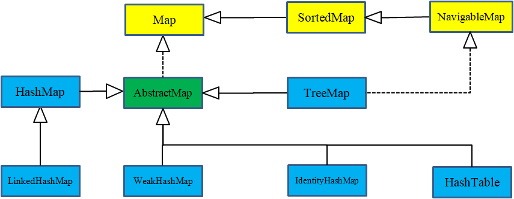

### java集合
java.util库提供相关的集合类

#### 泛型和类型安全的集合
如果一个类没有显式地声明继承自哪个类，那么它就自动继承自 Object）。因为 ArrayList 保存的是 Object ，可以将Object对象放入其中
要定义一个用于保存 Apple 对象的 ArrayList ，只需要使用 ArrayList<Apple> 来代替 ArrayList 。尖括号括起来的是类型参数（可能会有多个），它指定了这个集合实例可以保存的类型。

使用泛型，从 List 中获取元素不需要强制类型转换。因为 List 知道它持有什么类型，因此当调用 get() 时，它会替你执行转型。因此，使用泛型，你不仅知道编
译器将检查放入集合的对象类型，而且在使用集合中的对象时也可以获得更清晰的语法。即不需要使用(Apple) apple这样的声明语句

当指定了某个类型为泛型参数时，并不仅限于只能将确切类型的对象放入集合中。向上转型也可以像作用于其他类型一样作用于泛型：即B类继承自A类，设置存储A类的列表，
B类对象也可以放入该列表中

这种方式并非总是有效的，因为某些具体类有额外的功能。例如， LinkedList 具有 List 接口中未包含的额外方法，而 TreeMap 也具有在 Map 接口中未包含的
方法。如果需要使用这些方法，就不能将它们向上转型为更通用的接口。

#### 集合以及数组
1. Arrays.aslist()返回的列表是不可变更大小的
2. Collections类中有很多的实现方法，以下的这些集合类型，只要是继承了collections的类，就可以调用collection的addAll()方法将一个数组或者列表添加到collection中
，或者add将单一元素添加到集合

#### 集合的打印
arrays.toString()

1. ArrayList 和 LinkedList 都是 List 的类型，从输出中可以看出，它们都按插入顺序保存元素。两者之间的区别不仅在于执行某些类型的操作时的性能，而且 LinkedList 包含的操作多于 ArrayList 。本章后面将对这些内容进行更全面的探讨。
2. HashSet ， TreeSet 和 LinkedHashSet 是 Set 的类型。从输出中可以看到， Set 仅保存每个相同项中的一个，并且不同的 Set 实现存储元素的方式也不同。
如果存储顺序很重要，则可以使用 TreeSet ，它将按比较结果的升序保存对象）或 LinkedHashSet ，它按照被添加的先后顺序保存对象。
3. Map （也称为关联数组）使用键来查找对象，就像一个简单的数据库。所关联的对象称为值。

#### 列表list
1. 基本的 ArrayList ，擅长随机访问元素，但在 List 中间插入和删除元素时速度较慢。
2. LinkedList ，它通过代价较低的在 List 中间进行的插入和删除操作，提供了优化的顺序访问。 LinkedList 对于随机访问来说相对较慢，但它具有比 ArrayList 更大的特征集。
3. 数组生成后不可调整大小，而列表可以调整
4. List<? extends Pet>表示list中存放继承自Pet的类，可以放很多不同的类，称之为泛型的上限
5. List<? super Pet>表示list中存放Pet的父类，称之为泛型的下限
6. 可用arraylist将集合collection转变为数组

#### 迭代器
不清楚数组中的数量时使用，iterator生成迭代器，iterable表示可以产生iterator的东西

1. 使用 iterator() 方法要求集合返回一个 Iterator。 Iterator 将准备好返回序列中的第一个元素。
2. 使用 next() 方法获得序列中的下一个元素。
3. 使用 hasNext() 方法检查序列中是否还有元素。
4. 使用 remove() 方法将迭代器最近返回的那个元素删除。

#### ListIterator
ListIterator 是一个更强大的 Iterator 子类型，它只能由各种 List 类生成。可以进行双向移动它可以生成迭代器在列表中指向位置的后一个和前一个元素的
索引，并且可以使用 set() 方法替换它访问过的最近一个元素。可以通过调用 listIterator() 方法来生成指向 List 开头处的 ListIterator ，还可以通过
调用 listIterator(n) 创建一个一开始就指向列表索引号为 n 的元素处的 ListIterator 。 

#### 链表LinkedList
LinkedList 还添加了一些方法，使其可以被用作栈、队列或双端队列（deque）,允许向上转型为Deque,Queue,List,但不能转型为stack。
1. getFirst() 和 element() 是相同的，它们都返回列表的头部（第一个元素）而并不删除它，如果 List 为空，则抛出 NoSuchElementException 异常。 peek() 方法与这两个方法只是稍有差异，它在列表为空时返回 null 。
2. removeFirst() 和 remove() 也是相同的，它们删除并返回列表的头部元素，并在列表为空时抛出 NoSuchElementException 异常。 poll() 稍有差异，它在列表为空时返回 null 。
3. addFirst() 在列表的开头插入一个元素。
4. offer() 与 add() 和 addLast() 相同。 它们都在列表的尾部（末尾）添加一个元素。
5. removeLast() 删除并返回列表的最后一个元素。

#### 堆栈stack
ArrayDeque包含两个方法，push和pop，定义`Deque<T> storage = new ArrayDeque<>()`表示堆栈可以拥有T类型的对象，其中的T类型会被实际的类型所替换
，向上转型为Deque

#### Set集合
Set 不保存重复的元素。查找通常是 Set 最重要的操作，因此通常会选择 HashSet 实现，该实现针对快速查找进行了优化。
包含add,contains，containsAll,remove,removeAll,addAll方法,带All的检测的是针对另一个集合
还有TreeSet和LinkedHashSet
#### 映射Map
`Map<Integer,Integer> m = new HashMap<>()`，键值对映射，具有put(key,value)，get(key),containsKey(key)和constainsValue(value)方法。
以及keyset，返回由键组成的集合collection和set，以及values()返回由value组成的集合

|Map类型|插入是否有序|顺序特点|
|:---:|:---:|:---:|
|HashMap|无序|-|
|LinkedHashMap|有序|记录插入顺序|
|TreeMap|有序|默认升序|

#### 队列queue
队列是一个典型的“先进先出”（FIFO）集合。 即从集合的一端放入事物，再从另一端去获取它们，事物放入集合的顺序和被取出的顺序是相同的。
LinkedList 实现了 Queue 接口，并且提供了一些方法以支持队列行为，因此 LinkedList 可以用作 Queue 的一种实现。
Queue具有peek()返回队首,remove()队首出队,offer()队末加入等方法

#### 优先级队列PriorityQueue
PriorityQueue是允许重复的，最小值具有最高优先级，也可以通过调用自己的构造器改变构造的顺序

#### 集合与迭代器
对于collection类而言，只要是实现了collection的类就应该提供iterator，还可以用AbstractCollection实现类的操作，如果已经继承过别的类了，那么需要
自行定义匿名iterator以及相应的方法

#### for-in 和迭代器
for-in使用iterable接口来实现遍历，任何实现了iterable的类，都可以用于for-in语句中，数组array不是iterable

#### ArrayList和Arrays.asList
对Arrays.asList返回的list对象执行的操作都会造成底层数组的变化，如果不想出现这种变化，就需要用ArrayList保存一个副本

### 小结
1. 数组将数字索引与对象相关联。它保存类型明确的对象，因此在查找对象时不必对结果做类型转换。它可以是多维的，可以保存基本类型的数据。虽然可以在运行时创
建数组，但是一旦创建数组，就无法更改数组的大小。

2. Collection 保存单一的元素，而 Map 包含相关联的键值对。使用 Java 泛型，可以指定集合中保存的对象的类型，因此不能将错误类型的对象放入集合中，并且
在从集合中获取元素时，不必进行类型转换。各种 Collection 和各种 Map 都可以在你向其中添加更多的元素时，自动调整其尺寸大小。集合不能保存基本类型，但
自动装箱机制会负责执行基本类型和集合中保存的包装类型之间的双向转换。

3. 像数组一样， List 也将数字索引与对象相关联，因此，数组和 List 都是有序集合。

4. 如果要执行大量的随机访问，则使用 ArrayList ，如果要经常从表中间插入或删除元素，则应该使用 LinkedList 。

5. 队列和堆栈的行为是通过 LinkedList 提供的。

6. Map 是一种将对象（而非数字）与对象相关联的设计。 HashMap 专为快速访问而设计，而 TreeMap 保持键始终处于排序状态，所以没有 HashMap 快。 
LinkedHashMap 按插入顺序保存其元素，但使用散列提供快速访问的能力。

7. Set 不接受重复元素。 HashSet 提供最快的查询速度，而 TreeSet 保持元素处于排序状态。 LinkedHashSet 按插入顺序保存其元素，但使用散列提供快速访问的能力。

8. 不要在新代码中使用遗留类 Vector ，Hashtable 和 Stack 。

#### onjava提供的图片
集合相关的图片

映射相关的图片

- Java 集合框架简图，黄色为接口，绿色为抽象类，蓝色为具体类。虚线箭头表示实现关系，实线箭头表示继承关系。
