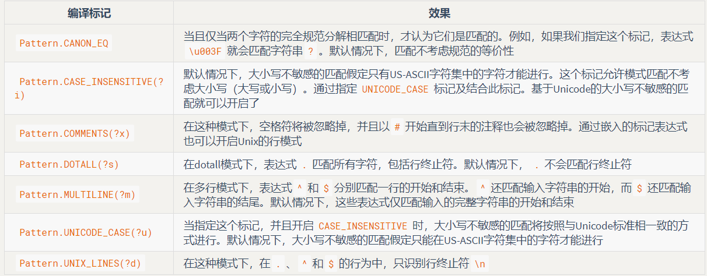

### 字符串
字符串操作毫无疑问是计算机程序设计中最常见的行为之一。

#### 字符串的不可变性
String 对象是不可变的。查看 JDK 文档你就会发现，String 类中每一个看起来会修改 String 值的方法，
实际上都是创建了一个全新的 String 对象，以包含修改后的字符串内容。而最初的 String 对象则丝毫未动。

#### +的重载和StringBuilder
用于 String 的 + 与 += 是 Java 中仅有的两个重载过的操作符，java禁止重载任何运算符

StringBuilder相比重载运算符+，在构造字符串上开销更小，

#### 意外递归
注意在转化对象为String时，需要提供一个toString方法，如果需要将对象的内存地址以字符串的方式输出，那么在方法中调用Object.toString方法
，参考文件[InfiniteRecursion.java](InfiniteRecursion.java)

#### 字符串操作
|方法|参数，重载版本|作用|
|:---:|:---:|:---:|
|构造方法|默认版本，String，StringBuilder， StringBuffer，char数组，byte数组|创建String对象|
|length()|-|String中字符的个数|
|charAt()|int索引|获取String中索引位置上的char|
|getChars()，getBytes()|待复制部分的开始和结束索引， 复制的目标数组，目标数组的开始索引|复制char或byte到一个目标数组中|
|toCharArray()|-|生成一个char[]，包含String中的所有字符|
|equals()，equalsIgnoreCase()|与之进行比较的String|比较两个String的内容是否相同。 如果相同，结果为true|
|compareTo()， compareToIgnoreCase()|与之进行比较的String|按词典顺序比较String的内容， 比较结果为负数、零或正数。注意，大小写不等价|
|contains()|要搜索的CharSequence|如果该String对象包含参数的内容，则返回true|
|contentEquals()|与之进行比较的CharSequence或StringBuffer|如果该String对象与参数的内容完全一致，则返回true|
|isEmpty()|-|返回boolean结果，以表明String对象的长度是否为0|
|regionMatches()|该String的索引偏移量， 另一个String及其索引偏移量， 要比较的长度。 重载版本增加了“忽略大小写”功能|返回boolean结果， 以表明所比较区域是否相等|
|startsWith()|可能的起始String。 重载版本在参数中增加了偏移量|返回boolean结果， 以表明该String是否以传入参数开始|
|endsWith()|该String可能的后缀String|返回boolean结果， 以表明此参数是否是该字符串的后缀|
|indexOf()，lastIndexOf()|重载版本包括：char，char与起始索引， String，String与起始索引|如果该String并不包含此参数，就返回-1； 否则返回此参数在String中的起始索引。 lastIndexOf()是从后往前搜索|
|matches()|一个正则表达式|返回boolean结果，以表明 该String和给出的正则表达式是否匹配|
|split()|一个正则表达式。 可选参数为需要拆分的最大数量|按照正则表达式拆分String， 返回一个结果数组|
|join()|分隔符，待拼字符序列。用分隔符将字符序列拼接成一个新的String|用分隔符拼接字符片段，产生一个新的String|
|substring()|重载版本：起始索引；起始索引+终止索引|返回一个新的String对象， 以包含参数指定的子串|
|concat()|要连接的String|返回一个新的String对象， 内容为原始String连接上参数String|
|replace()|要替换的字符，用来进行替换的新字符。 也可以用一个CharSequence替换另一个CharSequence|返回替换字符后的新String对象。 如果没有替换发生，则返回原始的String对象|
|replaceFirst()|要替换的正则表达式，用来进行替换的String|返回替换首个目标字符串后的String对象|
|replaceAll()|要替换的正则表达式， 用来进行替换的String|返回替换所有目标字符串后的String对象|
|toLowerCase()， toUpperCase()||将字符的大小写改变后，返回一个新的String对象。 如果没有任何改变，则返回原始的String对象|
|trim()||将String两端的空白符删除后， 返回一个新的String对象。如果没有任何改变， 则返回原始的String对象|
|valueOf()（static）|重载版本：Object；char[]；char[]， 偏移量，与字符个数；boolean；char；int； long；float；double|返回一个表示参数内容的String|
|intern()||为每个唯一的字符序列生成 一个且仅生成一个String引用|
|format()|要格式化的字符串，要替换到格式化字符串的参数|返回格式化结果String|

#### 格式化输出
控制字符串的输出格式

1. format()——该方法可以PrintStream或者PrintWriter对象，还包括System.out对象，String类也有一个format()方法，可以用于格式化字符
2. Formatter类（java.util.Formatter）——在 Java 中，所有的格式化功能都是由 java.util.Formatter 类处理的。可以将 Formatter 看做一个翻译器，
    它将你的格式化字符串与数据翻译成需要的结果。当你创建一个 Formatter 对象时，需要向其构造器传递一些信息，告诉它最终的结果将向哪里输出：
3. 格式化修饰符——参考博客[JAVA字符串格式化-String.format()的使用](https://blog.csdn.net/lonely_fireworks/article/details/7962171)
4. String.format()——String.format内部也是创建了一个Formatter对象

#### 正则表达式
1. 正则表达式匹配——String.matches()
2. String.split()分割字符串

#### Pattern和Matcher
导入 java.util.regex包，然后用 static Pattern.compile() 方法来编译你的正则表达式即可。它会根据你的 String 类型的正则表达式生成一个 Pattern 对象。

把你想要检索的字符串传入 Pattern 对象的 matcher() 方法。matcher() 方法会生成一个 Matcher 对象，

可利用find()在其中寻找多个匹配

#### 组group
组是用括号划分的正则表达式，可以根据组的编号来引用某个组。组号为 0 表示整个表达式，组号 1 表示被第一对括号括起来的组，以此类推。

Matcher对象提供了一系列方法，用以获取与组相关的信息：
1. public int groupCount() 返回该匹配器的模式中的分组数目，组 0 不包括在内。
2. public String group() 返回前一次匹配操作（例如 find()）的第 0 组（整个匹配）。
3. public String group(int i) 返回前一次匹配操作期间指定的组号，如果匹配成功，但是指定的组没有匹配输入字符串的任何部分，则将返回 null。
4. public int start(int group) 返回在前一次匹配操作中寻找到的组的起始索引。
5. public int end(int group) 返回在前一次匹配操作中寻找到的组的最后一个字符索引加一的值。

#### Pattern标记
Pattern 类的 compile() 方法还有另一个版本，它接受一个标记参数，以调整匹配行为：
`Pattern Pattern.compile(String regex, int flag)`

#### split
split()方法将输入 String 断开成 String 对象数组，断开边界由正则表达式确定：

#### 替换操作
1. replaceFirst(String replacement) 以参数字符串 replacement 替换掉第一个匹配成功的部分。
2. replaceAll(String replacement) 以参数字符串 replacement 替换所有匹配成功的部分。
3. appendReplacement(StringBuffer sbuf, String replacement) 执行渐进式的替换，而不是像 replaceFirst() 和 replaceAll() 那样只替换第一个匹配或全部匹配。这是一个非常重要的方法。它允许你调用其他方法来生成或处理 replacement（replaceFirst() 和 replaceAll() 则只能使用一个固定的字符串），使你能够以编程的方式将目标分割成组，从而具备更强大的替换功能。
4. appendTail(StringBuffer sbuf) 在执行了一次或多次 appendReplacement() 之后，调用此方法可以将输入字符串余下的部分复制到 sbuf 中。

#### reset
通过 reset() 方法，可以将现有的 Matcher 对象应用于一个新的字符序列：

#### 扫描输入
到目前为止，从文件或标准输入读取数据还是一件相当痛苦的事情。一般的解决办法就是读入一行文本，对其进行分词，
然后使用 Integer、Double 等类的各种解析方法来解析数据：

#### 用正则表达式扫描
使用自定义的正则表达式进行扫描，

